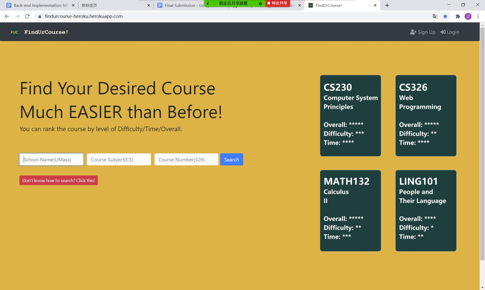
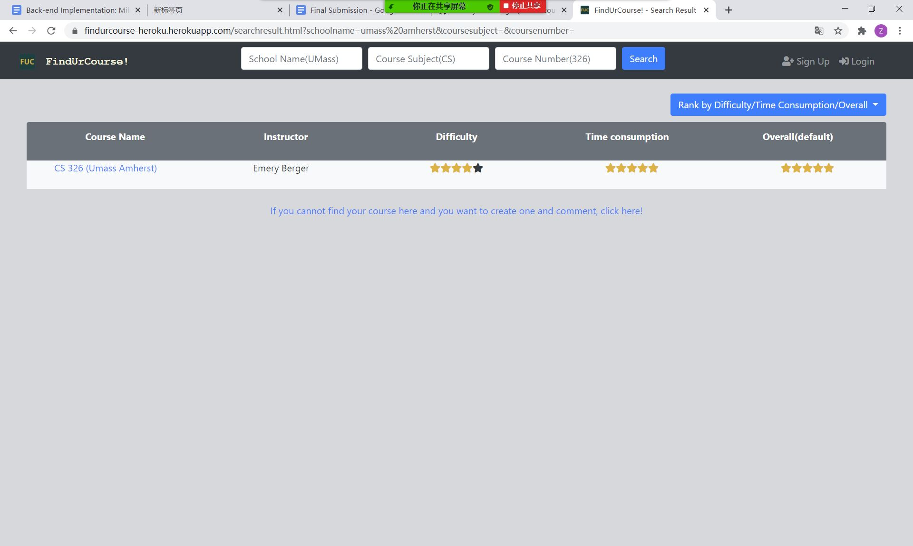
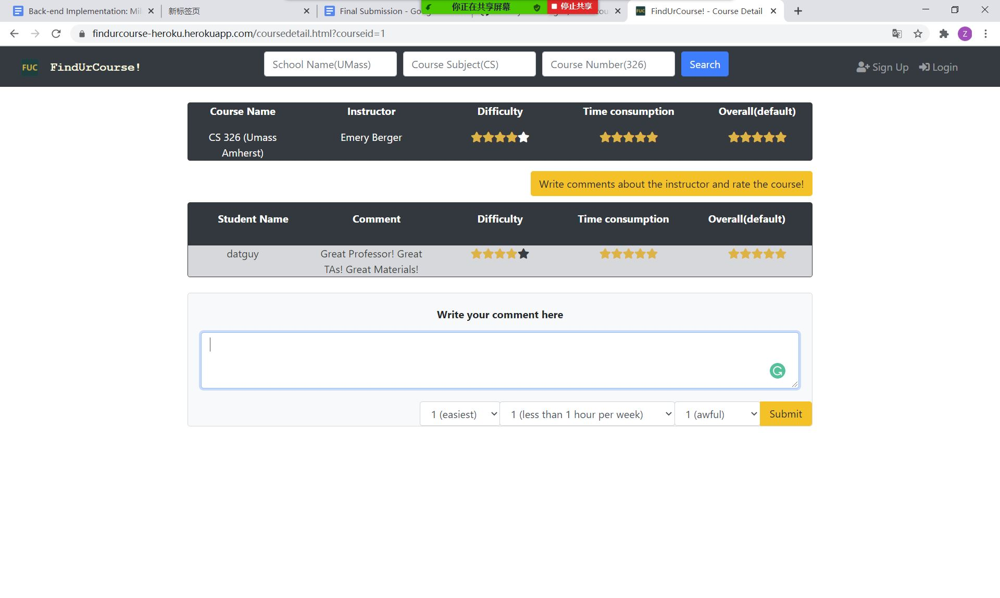
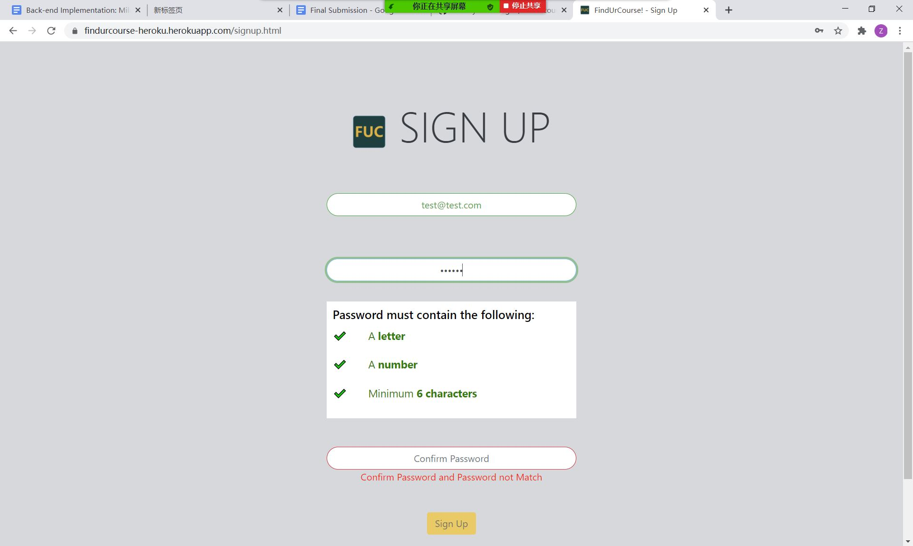
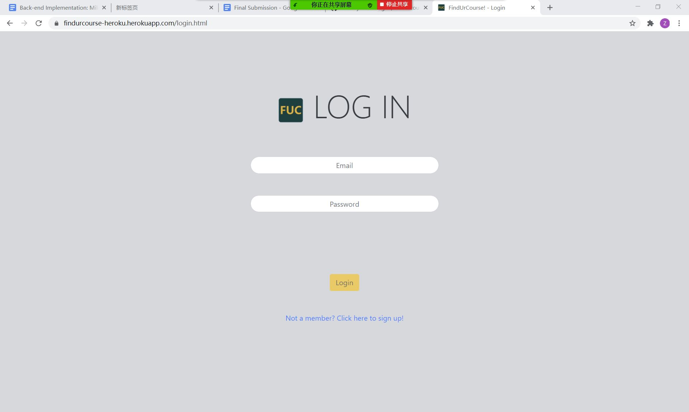
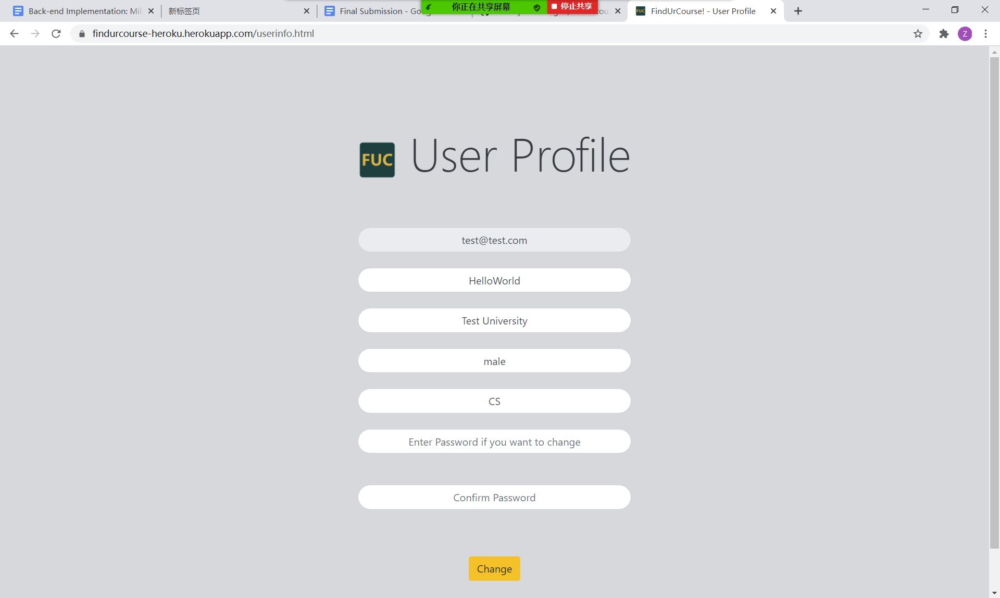
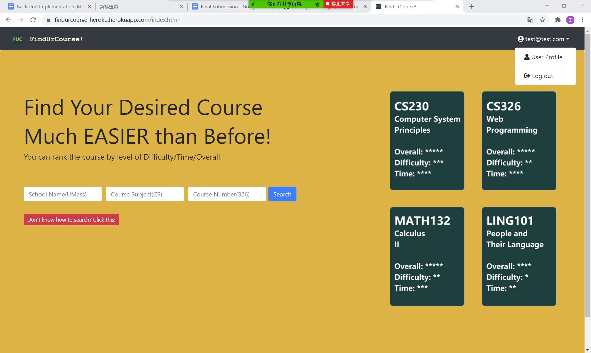
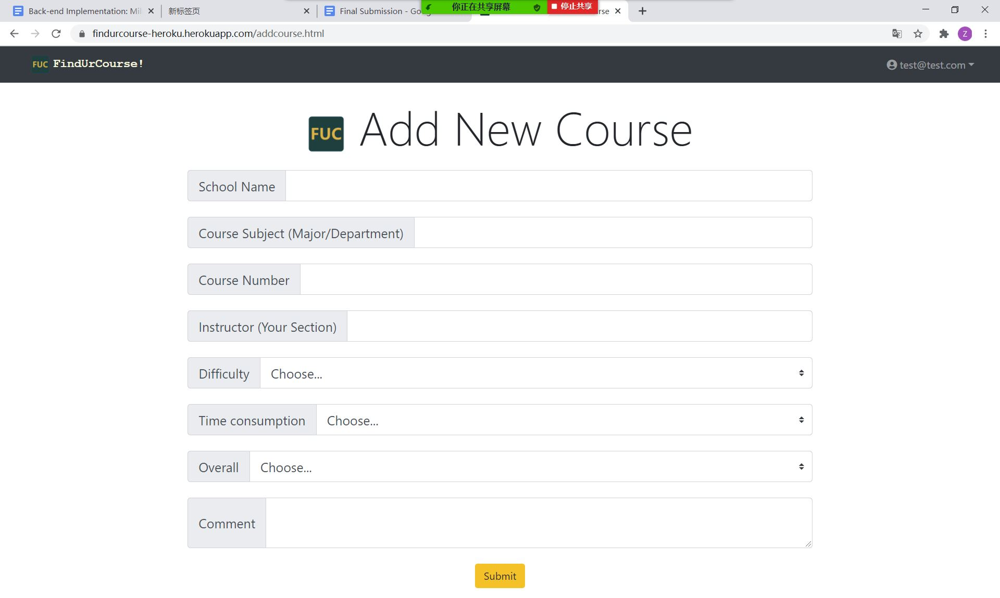

# **[cs326-final-beta](https://github.com/cozheyuanzhangde/cs326-final-beta)**
## App Name: Find Ur Course!

## Heroku Link: https://findurcourse-heroku.herokuapp.com/

### Semester: Fall 2020
### Overview:
This app is created for students who want to find their desired courses. Students can search/comment/add courses and rank them by difficulty, time consumption, and overall. I think our app is innovative because many students are struggling to find the most suitable course for themselves. Some students want challenging courses while some students want easy courses for giving their GPA a little boost. In the same course, different instructor will have many differences and students may want to choose based on their preferences. Also, findurcourse is based on courses and sections but not professors.
### Team Members:
1. Zheyuan(Brian) Zhang (Email: zheyuanzhang@umass.edu Github: cozheyuanzhangde) :

2. Jenny Guo (Email: jyguo@umass.edu Github: jennyg1017):

3. Fangming Cheng (Email: fangmingchen@umass.edu Github: FangmingCCC):

### User Interface: 
### Index home page (main page for findurcourse):

### Search result page (display courses after searching from either main page or search bar on other pages):

### Course detail page (display course detail include comments/add comments after clicking the course in search result page):

### Sign up page (For signing up):

### Log in page (For logging in):

### User info page (For changing/displaying user info including password):

### Index home page after log in (You can click on it to check userinfo page or log out):

### Add course page (Add a course with a comment):

### APIs
#### 1. Add New User
#### 2. Add New Course
#### 3. Add New Comment
#### 4. Update User Info
#### 5. Update User Info without Password change
#### 6. Update Course Info
#### 7. Load this course (load one course if apply)
#### 8. Load courses by school, subject and number
#### 9. Load courses by school, subject
#### 10. Load courses by school
#### 11. Load courses by courseID
#### 12. Check User Exist by email (load one user of a email address if apply)
#### 13. Load User Info by userid
#### 14. Load User Info by email
 
 ### Database: 
 CREATE TABLE users (userid SERIAL PRIMARY KEY, email VARCHAR(255), password VARCHAR[2], username VARCHAR(255), schoolname VARCHAR(255), gender VARCHAR(255), major VARCHAR(255));

CREATE TABLE courses (courseid SERIAL PRIMARY KEY, schoolname VARCHAR(255), coursesubject VARCHAR(255), coursenumber VARCHAR(255), instructor VARCHAR(255), difficulty INTEGER, time INTEGER, overall INTEGER);

CREATE TABLE coursecomments (courseid INTEGER, username VARCHAR(255), textcomment TEXT, difficulty INTEGER, time INTEGER, overall INTEGER);
#### TABLE users:
| Column | Data Type | Description |  
|--------------|-----------|--------------------------|  
| userid | SERIAL | Auto-increment User ID(Unique Identifier) |  
| email | VARCHAR(255) | User Email(Should be Unique) |
| password | Array VARCHAR[2] | User Password storing salt and hash as an array |
| username | VARCHAR(255) | User Name(Nick name) |
| schoolname | VARCHAR(255) | User School Name |
| gender | VARCHAR(255) | User gender |
| major | VARCHAR(255) | User major |

#### TABLE courses:
| Column | Data Type | Description |  
|--------------|-----------|--------------------------|  
| courseid | SERIAL | Auto-increment Course ID(Unique Identifier) |  
| schoolname | VARCHAR(255) | Course School Name(Umass Amherst) |
| coursesubject | VARCHAR(255) | Course Subject(CS) |
| coursenumber | VARCHAR(255) | Course Number(326) |
| instructor | VARCHAR(255) | Course Instructor |
| difficulty | INTEGER | Course Difficulty |
| time | INTEGER | Course Time Consumption |
| overall | INTEGER | Course Overall Evaluation |

#### TABLE coursecomments:
| Column | Data Type | Description |  
|--------------|-----------|--------------------------|  
| courseid | SERIAL | Auto-increment Course ID(Unique Identifier) |  
| username | VARCHAR(255) | User Name(Nickname) who commented(Default: Anonymous) |
| difficulty | INTEGER | Course Comment Difficulty |
| time | INTEGER | Course Comment Time Consumption |
| overall | INTEGER | Course Comment Overall Evaluation |

### URL Routes/Mappings:
All API URL Routes Described Above.
Besides, we also have:
/login: for logging in.
/loginfailure: for unsuccessful login.
/signup: for signing up
/getsession: get the session info
/logout: for logging out.
/private: after login go index.html.

### Authentication/Authorization:
1. User Info NEED Login in. (userinfo page)
2. Comment on a course NEED Login in. (coursedetail page)
3. Add a course NEED Login in. (addcourse page)
4. Log out NEED login in. (Search bar in every page if apply)

# Breakdown of the Division of Labor
Zheyuan(Brian) Zhang (Email: zheyuanzhang@umass.edu Github: cozheyuanzhangde) :
1.  Innovated website ideas including main functionalities and uniqueness from other websites existed.
2.  Website wireframes overall design.
3.  Documents(.md) writing and markdown design.
4.  Coding(HTML&CSS): Navigation bar and search bar in each page.
5.  Coding(HTML&CSS): Website main(index) page and User Info page.
6.  Coding(JavaScript): Affects in main(index) page.
7.  Coding(JavaScript): Back-end API endpoints Design Implementation and database structure design. (Final: /addnewcourse, /addnewcomment, /addnewuser, /loadcourses, /loadcoursesdetail, /changeuserinfo)
8.  Coding(JavaScript): Parameters passing from one page to another using URL including parsing them using Regular Expression from URL in the destination page.
9.  Coding(HTML/CSS): User Interface Updates for better user-experience.
10.  Coding(JavaScript): Front-end Interaction with the back-end server side which implements add new user, add new course, load courses, load coursesdetail, add new comment...
11.  Heroku Deployment /Github
12.  Documents(.md) writing and markdown design.
13.  Database Structure Design and Construction.
14.  Constructed back-end endpoints.
15.  Front-end Interaction/Design with the back-end endpoints.
16.  Rank courses by Difficulty/Time Consumption and Overall with options ascending and descending.
17.  Session works with Postgres Database (consistent).
18.  Fetch Session information in front-end with an endpoints in back-end.
19.  Front-end alert HTMLs/Javascripts which can be used for back-end response.
20.  Integration of website, documents writing and release with deployment of Heroku.
21.  User logged in can see the user email with a drop down menu with options of goto user profile and log out top right. If user not logged in, signup and login will show up top right.
22.  Session check on userinfo page with auto direction. User can view he or she's profile in userinfo page and can alter password if he or she wants. (Must Login First!). Session check on addcourse, coursedetail page which don't allow people comment without login in.
23.  Front-end beautification.
24.  All comments will use the username defined by session info user email. (username fetched from database by user email to front-end.)
25. Final Document Construction

Jenny Guo (Email: jyguo@umass.edu Github: jennyg1017):
1.  Website wireframes overall design.
2.  Coding(HTML&CSS): Course Detail page and User Login page.
3.  Coding(JavaScript): Affects in Course Detail page.
4.  Coding(JavaScript): Automatic increased comments in Course Detail page.
5.  Coding(HTML&CSS): Login/Signup/UserInfo template design for consistency.
6.  API Flow Chart Drawing.
7.  Coding(HTML/CSS): Created a new page called addnewcourse.html which provide an user interface for adding a new course.
8.  Coding(JavaScript): Front-end Interaction with back-end of adding a new course.
9.  Database Structure Design.
10.  Constructed back-end endpoints.
11.  Front-end Interaction/Design with the back-end endpoints.
12.  Hash encryption for user password by minicrypt.
13.  Basic session construction.
14.  Email Regular Expression Validation.
15.  Password Strength Validation. (Minimum 6 characters, A-Z and 0-9 contained)
16.  Blank Validation.
17.  Front-end beautification.
18. Final Document Construction

Fangming Cheng (Email: fangmingchen@umass.edu Github: FangmingCCC):
1.  Website wireframes overall design.
2.  Coding(HTML&CSS): Search Results page and User Signup page.
3.  Coding(JavaScript): Affects in Search Results page.
4.  Coding(JavaScript): Automatic increased comments in Search Results page.
5.  Coding(HTML&CSS): Login/Signup/UserInfo template design for consistency.
6.  Heroku Deployment /Fixing bugs.
7.  Coding(JavaScript): Back-end API endpoints skeleton draft code for searchresults and addnewcourse.
8.  Reform the root files to client and server.
9.  Coding(HTML): Fixed Missing IDs.
10.  Coding(JavaScript): JS part for addnewcourse.
11.  Database Structure Design.
12.  Constructed back-end endpoints.
13.  Front-end Interaction/Design with the back-end endpoints.
14.  Hash encryption for user password by minicrypt.
15.  Basic session construction.
16.  Email Regular Expression Validation.
17.  Password Strength Validation. (Minimum 6 characters, A-Z and 0-9 contained)
18.  Blank Validation.
19.  Front-end beautification.
20. Final Document Construction

### Conclusion:
The front-end design is basically based on bootstrap and we learned many stuffs in bootstrap for constructing a front-end user interface. For example, navbars, jumbotrons, and sizing like cols, margins...
The back-end server design is the most difficult part in this project. We learned how to constructing endpoints for front-end interaction. Database construction needs very precise understanding of our app so we know the importance of a database will perform in modern web applications. We also gain experience of how hashing the password and put that into the database. In addition, working with session is also a challenging topic but very interesting. Difficulties including session retrieval in front-end and display it on the top right corner as a normal website will do take me days to actually perform it. Those experiences in modern web developing is very precious and interesting. 

### Youtube Link to Video Demo: 