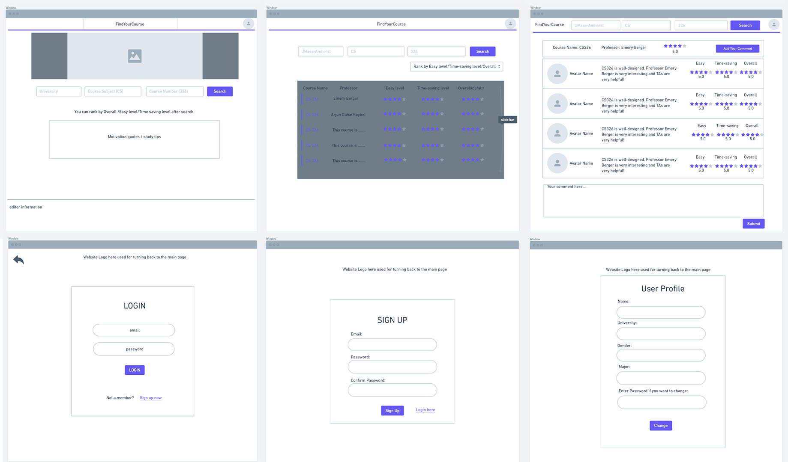

# Milestone 1: Project Wireframes
## 0. Data Interactions
### Innovative Idea (Same as before)

Our project idea is to make a course assessment website that allows students to assess each course in UMass (or even other universities) based on how hard it is, how much time it takes per week and how interesting it is. Therefore, users can enter data or retrieve sorted data on this website to see if this is an easy course or a hard one, an interesting course or not. There's a website called RateMyProfessor, but our application is quite different from RateMyProfessor as it is mainly based on ratings of a professor but our application focused on each course. It will also provide a simple and effective user interface that can make users understand how they can do the searches quickly.

### Important Components (Same as before)

Each course will have attributes of which university and which section(differed by different professors), and students will evaluate the hardness, average time is taken and level of interest(maybe we will add more) of the selected course. Therefore, college students will have a better option for selecting courses based on their situation. For example, if a student’s GPA is less satisfactory and he wants to raise his GPA a little bit, he can rank down the courses with a hard level and choose an easy course which he is interested in. If a student can’t decide which course is more interesting and useful, so he doesn’t know how to decide, he can also do the same on this website to see the comments and evaluations left by the students who have finished the course and then make his decision. 

#### (Updates data interactions) 
Students can either search a course and check it whether it is a desired course or rate it if he or she already taken (took) this course. Each course has 4 important components - School Name, Course Subject, Course Number and Professor Name. With these 4 components, we can make sure one course's overall rating, difficulty and time consumption (e.g. per week) will have a strong reference to another student who haven't take this course but want to take in the future.

## 1. Wireframes
The wireframes are collaboratively designed by us before we actually working onto the HTML/CSS, therefore there will have changes make to it in the actual design of the user interface.

All wireframes are separately stored in Github. Check the link: [folder](wireframe_imgs/)

## 2. HTML and CSS

## 3. Breakdown of the Division of Labor

Zheyuan(Brian) Zhang (Email: zheyuanzhang@umass.edu Github: cozheyuanzhangde) :
 1. Innovated website ideas including main functionalities and uniqueness from other websites existed.
 2. Website wireframes overall design.
 3. Documents(.md) writing and markdown design.
 4. Coding(HTML&CSS): Navigation bar and search bar in each page.
 5. Coding(HTML&CSS): Website main(index) page and User Info page.
 6. Coding(JavaScript): Affects in main(index) page.

Jenny Guo (Email: jyguo@umass.edu Github: jennyg1017):

 1. Website wireframes overall design.
 2. Coding(HTML&CSS): Course Detail page and User Login page.
 3. Coding(JavaScript): Affects and automatic increased comments in Course Detail page.

Fangming Cheng (Email: fangmingchen@umass.edu Github: FangmingCCC):

 1. Website wireframes overall design.
 2. Coding(HTML&CSS): Search Results page and User Signup page.
 3. Coding(JavaScript): Affects and automatic increased searched results in Search Results page.