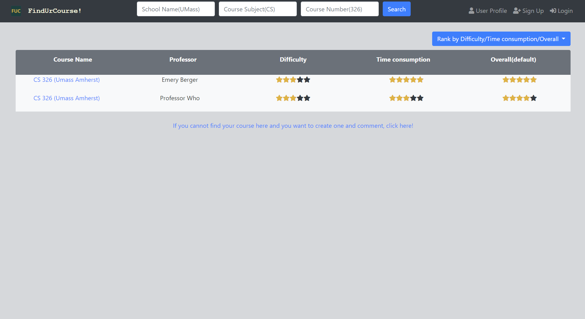

# Milestone 1: Project Wireframes

## 0. Project API Planning
### API Flow Chart

## 2. Front-end Implementation
### Indexpage search bar and search bars in other pages

This page will search courses results based on school name, course subject, and course number. With these 3 information, we can find a specific course in a given university/college(or other types of school). For now, the search functionalities have not been fully developed. It need user to input 3 blanks and need to specific about which university and which campus, for example, UMass(umass) will not work but umass amherst works, therefore it is not "too intelligent". Also "CS(cs)" will work but computer science will not work. There are also some other functionalities not fully developed. As progress, I will fix these problems if within my ability. By the way, it won't matter you use upper case or lower case. (So feel free to use UMass, Umass, umass, or even uMASS will also work, but don't forget the "amherst"! )
### API loadcourses
 
This page is the results after API loadcourses. It will output all the courses satisfy the search parameters. If all 3 parameters provided, this page will output same courses but with different sections of different professors. With 4 information(schoolname, course subject, coursenumber, and professor name), we can make sure the difficulty, time comsumption and overall evaluation will have a strong reference for other students. 
### API addnewcourse
In the bottom of searchresults page, you will be directed to a new page where you can add a new course! You have to leave one comment if you want to add a new course!
### API loadcoursesdetail and addnewcomment
 
This API read all the comments of a specific course selected on the previous page which is searchresults page. It also allows you to add a new comment. Comment here is not only a text but also a evaluation of difficulty, time consumption and overall. After adding, the new comment will appears on this page after an automatic reload(refresh) of this page.
### API addnewuser

This API allow user to register/signup on this website. Basically It takes an user email and an user password. Those will be stored in database.
### API changeuserinfo
This API will allow user to change userinfo but user email cannot be changed! Users can add username which default to Anonymous for privacy consideration. However, user can change username to what they want. After this, comments will appear he or she's username instead of Anonymous. Also, user can select gender, schoolname, major or change password. This API with front-end interaction will be fully developed after introducing PostgreSQL database into the project.
## 3. Link of heroku: 
## 4. Breakdown of the Division of Labor

Zheyuan(Brian) Zhang (Email: zheyuanzhang@umass.edu Github: cozheyuanzhangde) :

 1. Coding(JavaScript): Back-end API endpoints Design Implementation and database structure design. (Final: /addnewcourse, /addnewcomment, /addnewuser, /loadcourses, /loadcoursesdetail, /changeuserinfo)
 2. Coding(JavaScript): Parameters passing from one page to another using URL including parsing them using Regular Expression from URL in the destination page.
 3. Coding(HTML/CSS): User Interface Updates for better user-experience.
 4. Coding(JavaScript): Front-end Interaction with the back-end server side which implements add new user, add new course, load courses, load coursesdetail, add new comment...
 5. Heroku Deployment /Github
 6. Documents(.md) writing and markdown design.

Jenny Guo (Email: jyguo@umass.edu Github: jennyg1017):
1. API Flow Chart Drawing.
2. Coding(HTML/CSS): Created a new page called addnewcourse.html which provide an user interface for adding a new course.
3. Coding(JavaScript): Front-end Interaction with back-end of adding a new course.

Fangming Cheng (Email: fangmingchen@umass.edu Github: FangmingCCC):
1. Heroku Deployment /Fixing bugs.
2. Coding(JavaScript): Back-end API endpoints skeleton draft code for searchresults and addnewcourse.
3. Reform the root files to client and server.
4. Coding(HTML): Fixed Missing IDs.
5. Coding(JavaScript): JS part for addnewcourse.